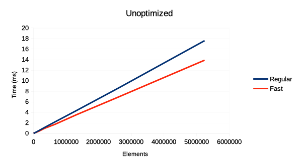
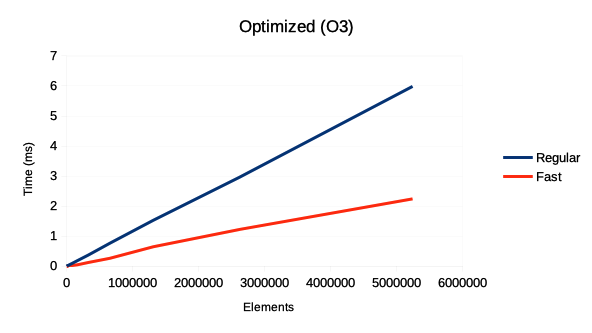

How to sum a list of floats
=============================

Summing a list of floats is easy, you can't do much better than this:

~~~
float sum(float* array, int len)
{
  float accu = 0.0f;
  for(int i = 0; i < len; ++i)
  {
    accu += array[i];
  }
  return accu;
}
~~~

Right?

Wrong!
--------
~~~
#define BATCH_SIZE 4 

float batched_sum(float* array, int len)
{
  float accu[BATCH_SIZE] = {0};
  for(int i = 0; i < len; i += BATCH_SIZE)
  {
    for(int j = 0; j < BATCH_SIZE; ++j)
    {
      accu[j] += array[i + j];
    }
  }
  return sum(accu, BATCH_SIZE);
}

float fast_sum(float* array, int len)
{
  int unbatched = len % BATCH_SIZE;
  return sum(array, unbatched) + batched_sum(&array[unbatched], len - unbatched);
}
~~~

"But how can this be faster? It doesn't make sense."

There are two effects at play here: 
  1) in the first code, the result of each summation operation depends on the previous one.
     A modern processor is able to execute multiple operations at a time, if the following operation doesn't depend on the result of a previous one
  2) Summing consequent elements pairwise can be implemented using SSE or similar SIMD instructions. 

How much faster is this?
--------------------------
I tested the functions on my old 2012 Mac Mini. The above code was compiled using Apple clang version 11.0.0.
The test generated exponentially larger input arrays filled with random floats. For each size 100 repetitions of a function
were calculated and the average running time was recorded. One of the runs is with O3 optimizations and the other with O0.

In the unoptimized case the gain is modest 21%, but with the optimization turned on, the batched version is 63% faster (takes only 37% of the time). The optimized version is able to benefit from the SIMD vectorization.

This is what Clang 9.0 (on Compiler Explorer) makes of the two loops in batched_sum:
~~~
.LBB2_10:                               # =>This Inner Loop Header: Depth=1
        movups  xmm2, xmmword ptr [rcx + 4*rdx]
        addps   xmm1, xmm2
        add     rdx, 4
        cmp     rdx, rax
        jl      .LBB2_10
~~~

It does also optimize the vanilla version, unrolling the loop like this:
~~~
.LBB0_9:                                # =>This Inner Loop Header: Depth=1
        addss   xmm0, dword ptr [rdi + 4*rcx]
        addss   xmm0, dword ptr [rdi + 4*rcx + 4]
        addss   xmm0, dword ptr [rdi + 4*rcx + 8]
        addss   xmm0, dword ptr [rdi + 4*rcx + 12]
        addss   xmm0, dword ptr [rdi + 4*rcx + 16]
        addss   xmm0, dword ptr [rdi + 4*rcx + 20]
        addss   xmm0, dword ptr [rdi + 4*rcx + 24]
        addss   xmm0, dword ptr [rdi + 4*rcx + 28]
        add     rcx, 8
        cmp     rdx, rcx
        jne     .LBB0_9
~~~
You notice that the generated code is still repeatedly loading a float at a time from memory and that it adds those floats one at a time to the xmm0 register. In comparison the batched code can load a whole xmm2 registers worth and then use packed add to add the values in parallel. 

But what about the other commutative monoids?
----------------------------------------------
I am so glad you asked. For the rest of you, monoid is the set of some elements (for example floats) together with a binary operation (such as addition), that allows regrouping of computation such that (a + b) + c = a + (b + c) and a zero element, such that a + 0 = a and 0 + a = a. When the monoid is commutative it means that a + b = b + a. These properties allow us to regroup the computations using multiple accumulators instead of one.

This technique can be generalized to any commutative monoid, but they won't neccessarily receive the same speed benefits. Not all of the operations can be vectorized and if the monoid operation is heavy enough, the next one would not fit in the processor pipeline. However, many common monoids could receive some boost, such as floats with minimum as the monoid addition and infinity as the zero value. Or integers, with 0 as the monoid zero and bitwise-or as the monoid addition. Lets try it.

~~~
#define MTYPE float
#define MPLUS(X, Y) fmin((X), (Y))
#define MZERO INFINITY

float fold(float* array, int len)
{
  MTYPE accu = MZERO;
  for(int i = 0; i < len; ++i)
  {
    accu = MPLUS(accu, array[i]);
  }
  return accu;
}

float batched_fold(float* array, int len)
{
  MTYPE accu[BATCH_SIZE] = {};

  for(int i = 0; i < BATCH_SIZE; ++i)
  {
    accu[i] = MZERO;
  }

  for(int i = 0; i < len; i += BATCH_SIZE)
  {
    for(int j = 0; j < BATCH_SIZE; ++j)
    {
      accu[j] = MPLUS(accu[j], array[i + j]);
    }
  }
  return fold(accu, BATCH_SIZE);
}

float fast_fold(float* array, int len)
{
  int unbatched = len % BATCH_SIZE;
  return MPLUS(fold(array, unbatched), batched_fold(&array[unbatched], len - unbatched));
}
~~~
